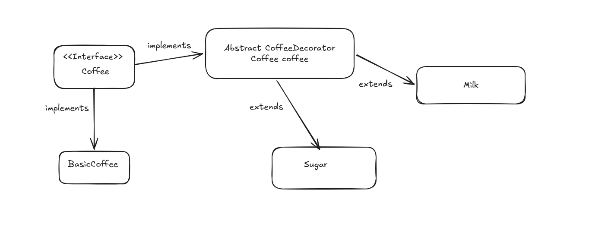

# Decorator Pattern




### Real world Analogy
- dominoPizza , base pizza can have many variations , leading to each add-on being a decorator
- Car , can have additional features added on to the base model.

### Implementation

```
// Online Java Compiler
// Use this editor to write, compile and run your Java code online

class Main {
    public static void main(String[] args) {
        Pizza pizza = new DominosPizza();
        pizza = new Cheese(new Paneer(pizza));
        
        System.out.println(pizza.price());
        pizza.description();
    }
}

interface Pizza {
    double price();
    void description();
}

class DominosPizza implements Pizza{
    @Override 
    public double price(){
        return 100;
    }
    
    @Override 
    public void description(){
        System.out.println("this is margherita");
    }
}

abstract class PizzaDecorator implements Pizza{
    protected Pizza pizza;
    
    //abstract public  double price();
    //abstract public void description();
    protected PizzaDecorator(Pizza pizza){
        this.pizza = pizza;
    }
    
    public void printPrice(){
        System.out.println("price : " + this.price());
    }
}

class Cheese extends PizzaDecorator{
    
    public Cheese(Pizza pizza){
        super(pizza);
    }
    
    @Override 
    public double price(){
        return pizza.price() + 300;
    }
    
    @Override 
    public void description(){
        pizza.description();
        System.out.println(" with cheese.");
    }
}

class Paneer extends PizzaDecorator{
    
    public Paneer(Pizza pizza){
        super(pizza);
    }
    
    @Override 
    public double price(){
        return pizza.price() + 150;
    }
    
    @Override 
    public void description(){
        pizza.description();
        System.out.println(" with Panner.");
    }
}
```